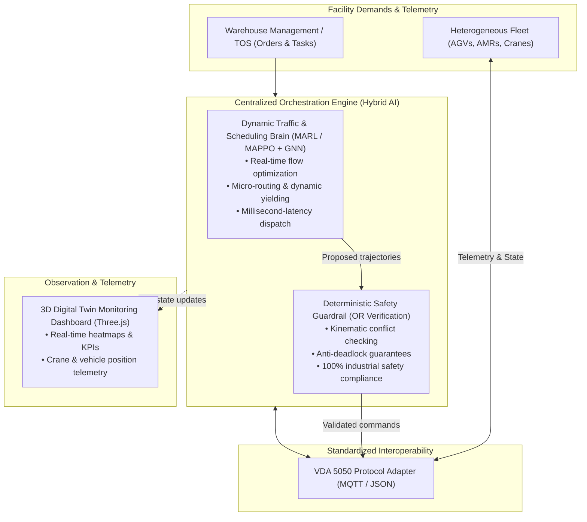

# Project Purpose & Strategic Charter: Smart Logistics & Fleet Coordination Platform

- **Motivation/Background**: Automated material handling and container scheduling suffer from severe scaling bottlenecks (deadlocks, intersection congestion) and proprietary OEM lock-in when operating heterogeneous AGV/AMR and yard crane fleets.
- **Purpose**: Codify the authoritative strategic charter, technical rationale, quantitative success criteria, and operational boundaries derived from the RAMemory startup concept document ([`DREAM.txt`](../DREAM.txt)).
- **Overview Pipeline**: Synthesized directly from [`DREAM.txt`](../DREAM.txt), aligned with the constitutional AI governance rules ([`agents/rules/MD_CONVENTION.md`](../agents/rules/MD_CONVENTION.md)), and established as the singular source of truth for downstream research and phase specifications.
- **Detailed Plan**: §1 Context & Executive Summary; §2 Market Need & Core Bottlenecks; §3 Technology Architecture (Hybrid MARL + OR Guardrails); §4 Measurable Success Criteria & KPIs; §5 Operational Boundaries & Non-Goals; §6 Compute & Deployment Constraints; §7 Locked Objective; §8 Downstream Roadmap & References.
- **References**: [`DREAM.txt`](../DREAM.txt), [`docs/OVERVIEW.md`](OVERVIEW.md), [`docs/phases/02_UI_DIGITAL_TWIN.md`](phases/02_UI_DIGITAL_TWIN.md), [`agents/rules/RESULTS_REPORTING.md`](../agents/rules/RESULTS_REPORTING.md).
- **Created**: 2026-09-14T21:58:00+07:00
- **Last Updated**: 2026-09-14T21:58:00+07:00

---

## 1. Context & Executive Summary

The **Smart Logistics & Fleet Coordination Platform** (developed by team **RAMemory**) is an industrial-grade, hardware-agnostic orchestration platform engineered to solve multi-vehicle routing, deadlock resolution, and container/pallet scheduling across modern automated logistics hubs (warehouses, 3PL/4PL fulfillment centers, and intermodal container terminals).

Modern automated facilities face a fundamental **Scaling Paradox**: as autonomous mobile robot (AGV/AMR) and automated crane counts increase beyond 20–30 units on a shared floor, traditional static routing algorithms (e.g., classical $A^*$, fixed-rule dispatchers) suffer exponential computational degradation. The resulting intersection blockades, long deadheading distances, and idle crane states cripple throughput and reduce overall return on investment (ROI).

Furthermore, hardware vendor lock-in prevents facilities from deploying mixed fleets from multiple manufacturers. This platform delivers a centralized **"air traffic control"** brain that decouples coordination software from hardware using international open standards (VDA 5050) and a high-performance **Hybrid AI** architecture combining **Multi-Agent Reinforcement Learning (MARL)** with deterministic **Operations Research (OR) Safety Guardrails**.



---

## 2. Market Need & Core Bottlenecks

Derived from empirical field observations and industry analysis in [`DREAM.txt`](../DREAM.txt), the platform directly addresses four systemic industry bottlenecks:

### 2.1 The Multi-Vehicle Scaling Paradox & Deadlocks
When fleet density exceeds 20–30 units, classical centralized pathfinding algorithms experience combinatorial explosion. In high-density environments, vehicles frequently encounter head-on conflicts, gridlocks at four-way intersections, and cascading delays, causing expensive equipment to sit idle while waiting for lockouts to clear.

### 2.2 Proprietary Hardware Vendor Lock-In
Major robot OEMs (e.g., Geek+, Quicktron, Hai Robotics) enforce closed software ecosystems. Facilities cannot run robot models from different vendors on the same floor without deploying isolated zones, leading to fragmented operations and excessive CapEx.

### 2.3 Dynamic Inefficiency & Excessive Deadheading
Static schedules cannot adapt to unexpected equipment faults, temporary physical obstructions, or sudden priority shifts. Consequently, up to 20% of fleet battery and operational time is squandered on empty travel (deadheading).

### 2.4 Industrial Distrust of "Black-Box" AI
Pure end-to-end deep learning or reinforcement learning policies lack formal safety and collision-avoidance guarantees. Industrial facility operators require verifiable safety protocols before deploying autonomous agents alongside human workers.

---

## 3. Technology Architecture & Breakthrough Innovations

The platform establishes four foundational technological pillars:

### 3.1 Hybrid AI: Multi-Agent RL + Deterministic OR Guardrails
- **Dynamic Decision Layer (MARL):** Utilizes Multi-Agent PPO (MAPPO) with Graph Neural Network (GNN) state encoders to perform distributed spatial decision-making, adaptive speed regulation, and cooperative yielding at intersections in under 10 milliseconds.
- **Safety Verification Layer (OR Guardrails):** A hard mathematical barrier based on time-space network flow constraints that intercepts and validates every proposed agent action against strict physical envelopes before execution, guaranteeing zero physical collisions.

### 3.2 Universal Interoperability (Native VDA 5050)
- Implements the European/global **VDA 5050** standard over MQTT/JSON.
- Provides a hardware-agnostic control interface, enabling seamless simultaneous control of mixed AGVs, AMRs, reach stackers, and automated container yard cranes.

### 3.3 High-Fidelity Digital Twin & Discrete Simulator
- Features an ultra-fast simulation environment ([`src/port_sim/`](../src/port_sim)) and interactive 3D Digital Twin visualization ([`ui/`](../ui), documented in [`docs/phases/02_UI_DIGITAL_TWIN.md`](phases/02_UI_DIGITAL_TWIN.md)).
- Enables rapid training over millions of steps, synthetic stress testing, and real-time operator observability.

---

## 4. Measurable Success Criteria & KPIs

All engineering implementations and experiment validation runs must be evaluated against the quantitative targets established in [`DREAM.txt`](../DREAM.txt):

| Category | Metric | Baseline / Industry Standard | Target Threshold | Validation Source / Method |
| :--- | :--- | :--- | :--- | :--- |
| **Throughput** | Pick Rate / Container Moves | Classical static dispatch | **+15% to +25% increase** | Discrete simulator & benchmark runs |
| **Fleet Efficiency** | Deadheading (Empty Travel) | Traditional heuristic planning | **15% – 20% reduction** | Accumulated distance metrics |
| **Deadlock Frequency** | Intersection Gridlocks | Common in >30 unit fleets | **0 deadlocks (100% resolution)** | Synthetic stress tests (100+ agents) |
| **Response Latency** | Action Inference & Safety Check | Multi-second centralized solve | **$\le$ 15 ms per step** | Benchmark telemetry in `src/eval/` |
| **Facility OpEx** | Total Warehousing Operating Cost | Existing manual/static fleet | **Up to 40% reduction** | Pilot facility financial model |
| **Equipment CapEx** | Initial Robot Investment Needed | Single-vendor bundled pricing | **20% – 30% savings** | Multi-vendor procurement analysis |
| **Payback Period** | Capital ROI Horizon | Standard 3.0 – 4.0 years | **2.0 – 2.5 years** | Economic impact model |
| **Software Uptime** | Operational Reliability | Standard WES requirements | **99.9% 24/7 continuous uptime** | CI integration & shadow runs |

---

## 5. Operational Boundaries & Non-Goals

To maintain high development velocity and focus computational resources, the following areas are explicitly declared **Out of Scope (Non-Goals)** for this phase:

- **Proprietary Hardware Manufacturing:** The project does *not* build physical robot chassis, LiDAR sensors, or motor controllers. All execution targets standardized VDA 5050 interfaces.
- **Low-Level Motor Control & SLAM:** Onboard localization, motor PID loops, and raw point-cloud SLAM remain the responsibility of the vehicle onboard firmware.
- **Monolithic ERP/WMS Replacement:** The system acts as a specialized **Fleet Execution / Micro-Routing Brain** (WES / Fleet Manager); it integrates via REST/MQTT with existing WMS/ERP systems rather than replacing financial or warehouse inventory software.
- **Pure Black-Box End-to-End Driving:** Autonomous vision-based driving without safety-rule verification is strictly prohibited in production pipelines.

---

## 6. Hardware, Compute & Deployment Constraints

- **Development & Training Workstations:**
  - Optimized for Apple Silicon (Mac mini M4 architecture) and NVIDIA workstation GPUs (CUDA 12/13).
  - Rapid parallel environment vectorization must run cleanly across multi-core CPU architectures without requiring large distributed HPC clusters for initial phases.
- **Edge Deployment Footprint:**
  - The inference engine and OR guardrail must execute reliably on lightweight on-premise industrial edge PCs or facility local servers with $\le 8$ GB RAM and low latency.
- **Deployment Topology:**
  - Hybrid architecture supporting on-premise edge deployments (for sub-millisecond safety guarantees and data sovereignty) paired with cloud SaaS reporting and fleet health monitoring.

---

## 7. Locked Objective

```
Deliver an industrial-grade, hardware-agnostic fleet coordination and container scheduling platform that combines Multi-Agent Reinforcement Learning (MAPPO) with deterministic Operations Research Safety Guardrails over VDA 5050, achieving a 15–25% increase in operational throughput, eliminating intersection deadlocks, and reducing empty transit distances by 15–20% on fleets exceeding 30 heterogeneous vehicles.
```

---

## 8. Downstream Roadmap & Documentation Map

Every implementation file and experiment plan in this repository traces its architectural justification back to this charter:

- **Constitutional AI Governance:** [`agents/README.md`](../agents/README.md) and [`agents/rules/FOLDER_STRUCTURE.md`](../agents/rules/FOLDER_STRUCTURE.md)
- **Living Roadmap & Track Status:** [`docs/OVERVIEW.md`](OVERVIEW.md)
- **Core Simulation Environment:** [`src/port_sim/`](../src/port_sim)
- **Training Pipeline & Algorithms:** [`src/training/train_rl.py`](../src/training/train_rl.py) and [`docs/phases/`](phases/)
- **Digital Twin & 3D Web Visualization:** [`docs/phases/02_UI_DIGITAL_TWIN.md`](phases/02_UI_DIGITAL_TWIN.md) and [`ui/`](../ui)
- **Testing & Verification Battery:** [`tests/`](../tests) and [`SETUP.md`](../SETUP.md)
