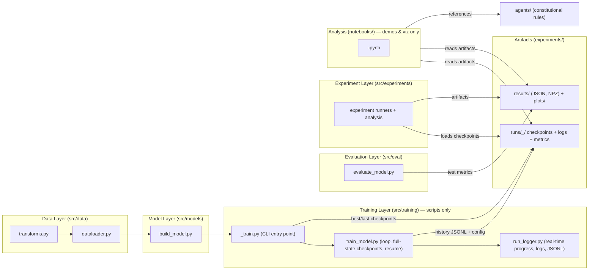

# [PROJECT_NAME]

- **Motivation/Background**: [PROJECT_NAME] implements a modular, reproducible deep-learning pipeline designed for robust research, high-performance training, and AI-assisted engineering.
- **Purpose**: Serve as the central portfolio entry point, architecture map, installation guide, and execution manual.
- **Overview Pipeline**: Follows strict Separation of Concerns (SoC) where all training runs as logged, resumable Python scripts, while notebooks are reserved for exploration, testing, and visualization.
- **Detailed Plan**: §1 Architecture; §2 Repository Layout; §3 Environment & Packaging; §4 Testing; §5 Governance.
- **References**: `agents/rules/`, `docs/`, `pyproject.toml`, `requirements.txt`.
- **Created**: 2026-07-25T00:00:00+07:00
- **Last Updated**: 2026-09-06T21:05:00+07:00


---

## 🏗️ Architecture Overview

Layered deep learning pipeline; each layer is a maintained `src/` package:



Key engineering guarantees:
- **Script-Only Training:** All training loops live in `src/training/*.py` or `src/experiments/*.py`. Notebooks never train.
- **Full-State Resumability:** Runs persist model, optimizer, scheduler, RNG state, config, and metrics per [agents/rules/LOGGING_CHECKPOINT_RULES.md](agents/rules/LOGGING_CHECKPOINT_RULES.md).
- **5W1H Empirical Context:** Every reported metric carries full 5W1H context per [agents/rules/RESULTS_REPORTING.md](agents/rules/RESULTS_REPORTING.md).
- **Strict Separation of Governance vs Memory:** Immutable constitutional rules live in [`agents/`](agents/), while evolving research notes, phase specifications, and experiment logs live in [`docs/`](docs/).

---

## 📁 Repository Structure

The template supports both **Single-Track** (default monolithic layout shown below) and **Multi-Track / Feature-Modular** layouts (for multi-lab coursework or modular research tracks). See [agents/rules/FOLDER_STRUCTURE.md](agents/rules/FOLDER_STRUCTURE.md) for full principles and placement rules.

```text
[PROJECT_NAME]/
├── agents/                    # Constitutional AI Governance (Immutable rules & templates)
│   ├── README.md              # Governance navigation guide
│   ├── rules/                 # Binding standards (AGENT_AI, FOLDER_STRUCTURE, MD, etc.)
│   └── templates/             # Reusable skeletons (BUG, AUDIT, EXP, PHASE, PROGRESS)
│
├── docs/                      # Evolving Project Research & Memory (Global)
│   ├── README.md              # Master research index
│   ├── PURPOSE.md             # Project brief & locked success criteria
│   ├── OVERVIEW.md            # Living roadmap indexing all tracks/phases
│   ├── shared/                # Universal SOPs (HOW_TO_SETUP_AI_AGENT, HANDOFF_TEMPLATE)
│   ├── phases/                # Pipeline phase technical specifications
│   ├── progress/              # Live phase status tracking (*_STATUS.md)
│   ├── experiments/           # Experiment plans and comparative writeups
│   ├── bugs/                  # Resolved and active bug reports
│   └── references/            # Reusable technical guides (Git, Optuna, etc.)
│
├── configs/                   # Configuration files (YAML)
│   └── config.yaml.example    # Configuration skeleton
│
├── data/                      # Dataset assets (ignored in git)
│   ├── raw/                   # Immutable raw inputs (never written by scripts)
│   └── processed/             # Cleaned splits and extracted features
│
├── src/                       # Maintained Python packages (or partitioned into tracks/)
│   ├── data/                  # Loading, transforms, dataloaders
│   ├── models/                # Neural network architectures
│   ├── training/              # Script-only training entry points
│   ├── eval/                  # Evaluation metrics & benchmark tables
│   ├── experiments/           # One-shot experiment runners
│   └── utils/                 # Logging, checkpoints, telemetry
│
├── notebooks/                 # Exploratory analysis & demo notebooks (NEVER train)
│
├── experiments/               # Experiment runtime outputs (runs/ & results/ gitignored)
│   ├── runs/<ts>_<run>/       # checkpoints/ logs/ metrics/ tensorboard/
│   └── results/               # Consolidated metrics & export plots
│
├── requirements/              # Multi-tier dependency specs (base.txt, dev.txt)
├── requirements.txt           # Unified dependency proxy (-r requirements/dev.txt)
├── pyproject.toml             # Build system & package discovery config
└── tests/                     # Unit and integration test suite
```

> [!TIP]
> **Multi-Track / Feature-Modular Projects:** When work naturally divides into distinct labs, features, or research questions, code, tests, configs, and experiment specs can be **colocated** within that unit (e.g. `tracks/<name>/` or `labs/<name>/`), while keeping `/agents`, global roadmap (`docs/OVERVIEW.md`), and base dependencies centralized.


---

## ⚙️ Installation & Setup

### 1. Environment Creation

```bash
# Windows
python -m venv .venv
.\.venv\Scripts\activate

# Linux / macOS
python3 -m venv .venv
source .venv/bin/activate
```

### 2. Dependency Installation

```bash
# Upgrade pip
python -m pip install --upgrade pip

# Standard / CPU Installation
pip install -r requirements.txt
pip install -e .

# Optional: NVIDIA GPU Workstations (CUDA 13.0 wheels)
# pip install torch torchvision --index-url https://download.pytorch.org/whl/cu130
# pip install -r requirements.txt
# pip install -e .
```

---

## 🧪 Testing & Verification

Run the test battery:
```bash
pytest tests/ -v -m "not gpu"
ruff check src tests
python -c "import src; print('Package import verified!')"
```

---

## 📜 Governance & Workflow

- AI agents adhere to the 6-stage lifecycle: `AUDIT → PLAN → IMPLEMENT → VERIFY → COMMIT → MERGE` ([agents/rules/AGENT_AI.md](agents/rules/AGENT_AI.md)).
- Setup procedures are codified in [docs/shared/HOW_TO_SETUP_AI_AGENT.md](docs/shared/HOW_TO_SETUP_AI_AGENT.md).
- Inter-agent checkpoints follow [docs/shared/HANDOFF_TEMPLATE.md](docs/shared/HANDOFF_TEMPLATE.md).
