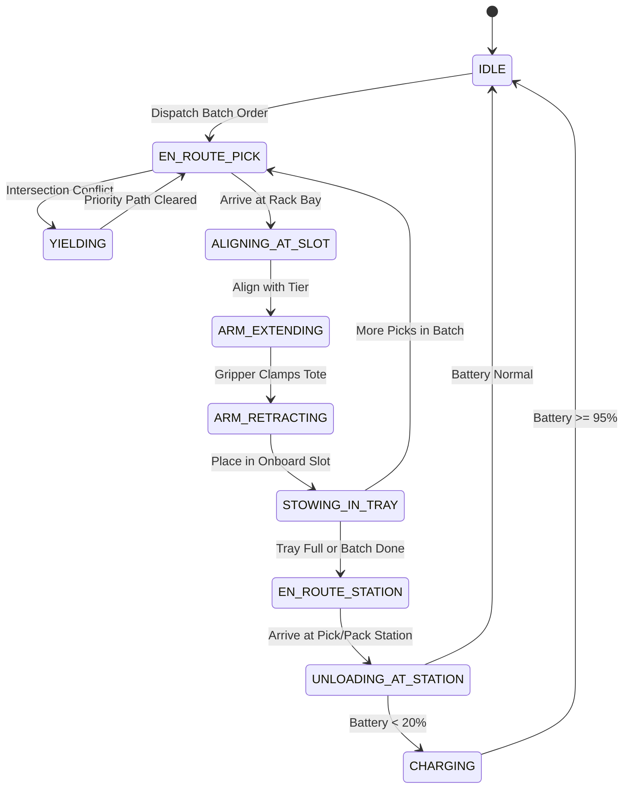
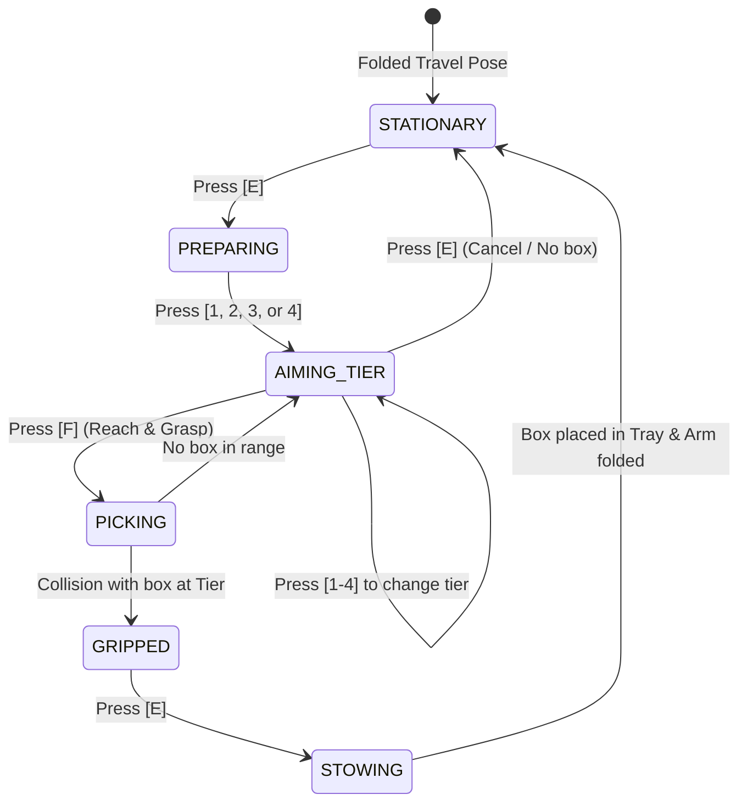

# 04_WAREHOUSE_SIMULATION_ENVIRONMENT.md — Smart Warehouse Mobile Manipulator Simulation Specification

- **Motivation/Background**: Moving beyond illustrative frontend animations ("vibe code") requires a physically grounded, mathematically deterministic warehouse simulation engine. Modern automated fulfillment centers deploy Autonomous Mobile Manipulators (AMRs with robotic picking hands) that retrieve individual SKU tote boxes from 4-tier racking and transport multi-tote batches to pick stations.
- **Purpose**: Specify the complete architectural blueprint, spatial topology, mobile manipulator kinematics, time-space reservation anti-deadlock mechanics, discrete inventory system, and Godot 3D visualization contracts.
- **Overview Pipeline**: Python backend (`src/warehouse/`) computes the ground truth graph physics, reservation table, inventory WMS, and kinematic stepping, while Godot 4 renders the 3D Digital Twin and 2D radar over VDA 5050.
- **Detailed Plan**: §1 Scope & Agreed Architectural Decisions; §2 Input & Output Contracts; §3 Mobile Manipulator Kinematics & Arm Picking Mechanics; §4 Time-Space Anti-Deadlock Engine; §5 Discrete Inventory & Fulfillment Lifecycle; §6 Godot 3D Synchronization & Visual Controls.
- **References**: `docs/PURPOSE.md`, `docs/DREAM/DREAM.md`, `agents/templates/PHASE_DOC_TEMPLATE.md`, `agents/rules/FOLDER_STRUCTURE.md`.
- **Created**: 2026-09-15T07:57:00+07:00
- **Last Updated**: 2026-09-15T08:04:00+07:00

---

## Metadata

- **Phase ID**: `PHASE-04`
- **Phase Name**: `Autonomous Mobile Manipulator Warehouse Simulation Engine & Mechanics`
- **Status**: In Progress
- **Target Modules**: [`src/warehouse/`](../../src/warehouse), [`godot/scripts/`](../../godot/scripts), [`src/utils/warehouse_bridge.py`](../../src/utils/warehouse_bridge.py)

---

## 1. Scope & Core Architectural Decisions

Following the `/grill-me` architectural design review, the simulation mechanics are locked as follows:

1. **Decoupled Architecture**:
   - **Python Core Engine (`src/warehouse/`)**: Runs ground-truth discrete-event simulation, directed grid graph, differential-drive kinematics, time-space conflict reservations, and WMS inventory tracking. Capable of fast-stepping (>1,000 steps/s) or real-time 1x clock synchronization.
   - **Godot 4 Digital Twin (`godot/`)**: High-fidelity 3D client rendering vehicle meshes, animated robotic arms, 2D Zoned Radar, and interactive operator controls via VDA 5050 WebSocket (`ws://127.0.0.1:9090`).
2. **Small Tote Boxes as the Smallest Transport Unit**:
   - The warehouse racking is stationary (4 tiers per bay).
   - The smallest transport unit is an individual **SKU Tote Box** (colored bins: Cyan=FMCG, Green=Tech, Purple=Pharma, Orange=Bulky).
3. **Mobile Manipulator Robot (MoMa)**:
   - Differential-drive mobile base with 360° LED ring.
   - Onboard payload tray capable of carrying **2 to 4 boxes** per run (enabling multi-pick batch routing).
   - Articulated **Robotic Arm / Picking Hands**:
     - **Vertical Lift (Up/Down)**: Traverses between Tiers 1 through 4 ($h = 0.4\,\text{m}$ to $2.2\,\text{m}$).
     - **Lateral Extension (Left/Right)**: Extends into shelf bays on either side of the aisle.
     - **Gripper Hands**: Pulls the target tote out and places it into the robot's onboard tray.
4. **Time-Space Anti-Deadlock Coordination**:
   - Directed grid graph ($1.2\,\text{m}$ node spacing).
   - Time-Space Reservation Table claiming `(node, [t_enter, t_exit])` and `(edge, [t_enter, t_exit])`.
   - Deterministic priority yielding at 4-way intersections with stop-bar holding (LED turns Yellow).
5. **Discrete WMS Coordinate System**:
   - Every box slot is indexed: `(Zone, Rack, Tier [1-4], Slot [1-4])`.
   - Picked slots become `EMPTY` and are re-filled during Inbound PO receiving cycles.
6. **Ergonomics & Camera**:
   - Real-time physical scale (1x) with HUD time-scale multipliers ($1\times, 2\times, 5\times$, Pause).
   - Tactical RTS overview presets (`1`–`4`) + interactive click-to-follow 3rd-person AMR camera with automatic close-up zoom during arm picking.

---

## 2. Input & Output Contracts

### Inputs
- **Facility Grid Definition**: Racking aisles, node coordinates, directed one-way/two-way highway rules, dock coordinates, and charging pads.
- **WMS Order Manifests**:
  - Outbound Sales Orders (`SO-xxx`): Target SKU, required quantity, target Pick Station.
  - Inbound Purchase Orders (`PO-xxx`): Incoming SKU, quantity, arrival dock.

### Outputs (VDA 5050 State Snapshot)
```json
{
  "vda5050_topic": "vda5050/v2/warehouse/state",
  "sim_time": 124.5,
  "time_scale": 1.0,
  "kpis": {
    "pick_rate_picks_per_hour": 340.0,
    "pick_rate_boost_pct": 22.5,
    "deadlocks": 0,
    "deadheading_ratio": 13.8,
    "active_fleet_count": 4
  },
  "inventory": {
    "total_slots": 128,
    "occupied_slots": 112,
    "empty_slots": 16
  },
  "fleet": {
    "AMR-01": {
      "x": -18.2,
      "z": 4.8,
      "heading_deg": 90.0,
      "velocity": 1.2,
      "state": "PICKING",
      "battery": 94.5,
      "carried_totes": [
        {"sku": "FMCG Beverage", "color": "#00e5ff", "slot_idx": 0},
        {"sku": "Tech Hardware", "color": "#1aff70", "slot_idx": 1}
      ],
      "arm": {
        "tier": 2,
        "side": "LEFT",
        "extension_pct": 0.85,
        "action": "RETRACTING"
      }
    }
  }
}
```

---

## 3. Execution Pipeline & Mechanics Engine

```text
WMS Orders (Inbound / Outbound)
              │
              ▼
   Task & Batch Allocator ──► Assigns 2-4 pick targets to nearest AMR
              │
              ▼
Time-Space A* / Conflict Router ──► Reserves [t_enter, t_exit] on nodes/edges
              │
              ▼
   Kinematic Stepper (dt = 0.05s)
   ├─ In-place rotation (omega = 120 deg/s)
   ├─ Linear acceleration (a = 1.0 m/s^2, v_max = 1.5 m/s)
   ├─ Arm vertical lift & lateral reach (t_pick = 2.5s)
   └─ Station dwell & unload (t_unload = 1.5s/box)
              │
              ▼
   VDA 5050 WebSocket Publisher ──► Godot 4 3D Digital Twin Client
```

---

## 4. Technical Specifications

### 4.1 Mobile Manipulator Physical Model
- **Base Footprint**: $0.9\,\text{m} \times 0.7\,\text{m} \times 0.35\,\text{m}$.
- **Drive System**: Differential non-holonomic drive (turns in place about center of axle).
- **Onboard Tray**: 4 partitioned bays ($2 \times 2$ matrix) on the rear deck holding standard $400 \times 300\,\text{mm}$ plastic totes.
- **Vertical Mast**: Centrally mounted linear actuator column ($z = 0.4\,\text{m}$ to $2.2\,\text{m}$).
- **Articulated Hand**: Telescopic horizontal slide ($0.8\,\text{m}$ reach) with pneumatic/clamp gripper.

### 4.2 State Machine


### 4.3 Developer Manual Bot (`DEV-01`) Interactive Motion Sequence

For manual environment testing and physical validation, `DEV-01` features an interactive arm state machine:



- **Motion Sequence Rules**:
  1. **Stationary State**: Arm folded in home resting pose ($0^\circ$ yaw, folded boom and forearm). No box in hand. Differential driving active via `WASD` / Arrow keys.
  2. **Prepare for Pickup (`E`)**: Swivels arm to face the nearest storage rack (detects Left vs. Right side via local transform projection). Elevates to ready posture.
  3. **Select Rack Tier (`1`, `2`, `3`, `4`)**: Adjusts shoulder, elbow, and wrist joint pitch to align with the selected rack tier elevation (Tier 1: $0.62\,\text{m}$, Tier 2: $1.18\,\text{m}$, Tier 3: $1.74\,\text{m}$, Tier 4: $2.30\,\text{m}$). Camera presets are cleanly overridden so view does not jump.
  4. **Pick Up Box (`F`)**: Arm extends into shelf bay. Detects physical/geometric collision with shelf tote at that tier. If present, removes box from rack and grasps it with gripper (`has_gripped_box = true`). If no box, retracts and prompts player.
  5. **Stow to Tray / Fold (`E`)**:
     - **If box is held**: Swivels $180^\circ$ towards rear cargo tray, lowers box onto tray bed, transfers tote box to tray, and folds arm back to stationary.
     - **If no box is held**: Folds arm directly back to stationary resting pose.

### 4.4 Audio Design & Sound Effects Mapping

To provide tactile, responsive operator feedback without project bloat (<300 KB total), an audio layer is configured via [`SoundManager`](../../godot/scripts/utils/sound_manager.gd):

| Event | Bus / Space | Asset Source | File |
| :--- | :--- | :--- | :--- |
| **Button Click / Spawn** | 2D UI | `MenuSFX/OGG/Abstract` | `res://audio/ui/click.ogg` |
| **Reset / Cancel** | 2D UI | `MenuSFX/OGG/Abstract` | `res://audio/ui/cancel.ogg` |
| **Camera / Fullscreen Toggle** | 2D UI | `MenuSFX/OGG/Abstract` | `res://audio/ui/toggle.ogg` |
| **Arm Prepare Swivel** | 3D Spatial | `MenuSFX/OGG/Abstract` | `res://audio/sfx/arm_prepare.ogg` |
| **Rack Tier Select (1..4)** | 3D Spatial | `MenuSFX/OGG/Abstract` | `res://audio/sfx/tier_select.ogg` *(rising pitch $0.85 \rightarrow 1.33$)* |
| **Box Grasp / Pick Latch** | 3D Spatial | `MenuSFX/OGG/Abstract` | `res://audio/sfx/box_pick.ogg` |
| **Box Stow to Cargo Tray** | 3D Spatial | `MenuSFX/OGG/Abstract` | `res://audio/sfx/box_stow.ogg` |
| **Hydraulic Brake Impact** | 3D Spatial | `SweetSounds_SFX/WAV` | `res://audio/sfx/brake.wav` |

---

## 5. Verification & Implementation Phases

1. **Step 1 (`src/warehouse/core/`)**:
   - Implement `grid_map.py`: Discrete directed graph, node types, aisle coordinates.
   - Implement `inventory_manager.py`: Discrete rack slots, SKU categories, occupancy tracking.
2. **Step 2 (`src/warehouse/simulation/`)**:
   - Implement `reservation_table.py`: Time-space conflict resolver with priority yielding.
   - Implement `amr_kinematics.py`: Differential drive kinematics, arm pick/stow sequences, battery model.
   - Implement `warehouse_env.py`: Gym-compatible step/reset loop with configurable time-scaling.
3. **Step 3 (`godot/`)**:
   - Update `amr_robot.tscn`: Mobile Manipulator chassis, articulated 3-joint picking arm, rear cargo tray.
   - Implement interactive Developer Manual Bot arm state machine (`E` prepare $\rightarrow$ `1-4` tier $\rightarrow$ `F` pick $\rightarrow$ `E` stow/fold).
   - Implement interactive 3rd-person follow chase camera (`C`).
