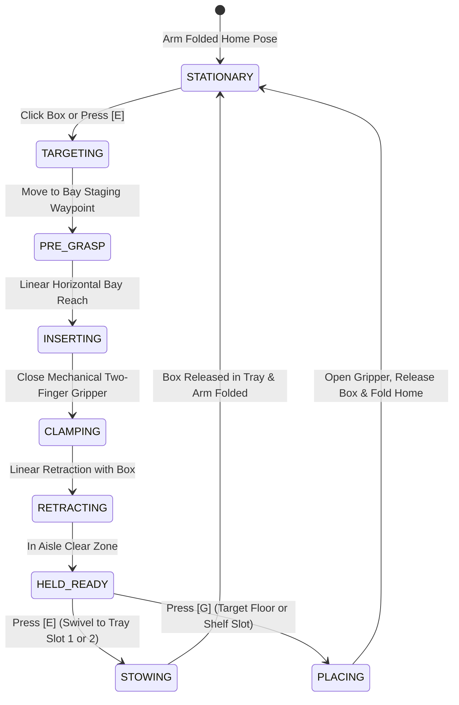

# DYNAMIC_ROBOTIC_ARM_DESIGN_DECISIONS.md — Autonomous Mobile Manipulator Dynamic Arm & Gripper Architecture

- **Motivation/Background**: The initial simulation implementation relied on pre-baked geometric elevation angles triggered by hardcoded keyboard keys [1, 2, 3, 4]. Advancing the Autonomous Mobile Manipulator (MoMa) to true dynamic industrial realism requires continuous 3D Inverse Kinematics (IK), mechanical two-finger clamping, dynamic trajectory insertion, and robust physics collision resolution.
- **Purpose**: Serve as the living architectural design decision record (DDR) and trade-off reference matrix for the dynamic robotic arm and pickup system, documenting all design branches, options considered, and selected pathways so future contributors can revisit or toggle approaches.
- **Overview Pipeline**: Formulated during the comprehensive `/grill-me` architectural design review between developer and AI pair programmer.
- **Detailed Plan**: §1 Master Decision Matrix; §2 Branch 1: Gripper & Clamping Mechanism; §3 Branch 2: Kinematic Model & 3D Target IK; §4 Branch 3: Approach Trajectory & Clearance; §5 Branch 4: Target Selection & Interaction; §6 Branch 5: Cargo Tray Retention; §7 Branch 6: Reach Guardrails; §8 Branch 7: Dynamic Pick & Place Flow.
- **References**: `docs/phases/04_WAREHOUSE_SIMULATION_ENVIRONMENT.md`, `agents/rules/MD_CONVENTION.md`, `godot/scripts/entities/amr_robot.gd`.
- **Created**: 2026-09-15T10:36:00+07:00
- **Last Updated**: 2026-09-15T10:39:00+07:00

---

## 1. Master Decision Matrix

| # | Design Branch | Selected Pathway | Alternative Options Available | Rationale / Trade-off Summary |
| :--- | :--- | :--- | :--- | :--- |
| **Q1** | **Gripper & Pickup Mechanism** | **Hybrid Two-Finger Mechanical Clamp** | 1. Magnetic/Vacuum Socket Lock 2. Generic6DOF Physics Joint 3. Pure Friction Clamp | Mechanical visual fidelity + zero slipping risk via bilateral contact-assisted constraint. |
| **Q2** | **Kinematic Model & Targeting** | **Continuous 3D Target IK Solver** | 1. Proximity Raycast Auto-Align 2. Direct Manual Multi-Axis Joint Control | Closed-form analytical Two-Bone IK computes joint angles in real-time to any $(X, Y, Z)$ target. |
| **Q3** | **Approach Trajectory** | **3-Stage Waypoint Trajectory** | 1. Pure Continuous 3D Bezier Spline 2. Live Interactive Cursor Gizmo | `Pre-Grasp Staging -> Linear Insertion -> Linear Retraction` prevents clipping rack beams. |
| **Q4** | **Target Selection & Interaction** | **Interactive 3D Click & Proximity Hybrid** | 1. Pure 3D Mouse Raycast 2. Autonomous Proximity Cone Only | Direct mouse raycast click on any box in viewport OR press `[E]` to auto-target nearest box in front. |
| **Q5** | **Tray Retention & Physics** | **Multi-Slot Physical Tray with Guardrails** | 1. Secured Tray Bed (Rigid Weld Lock) 2. Single Centered Carrier Slot | Real physical multi-box transit; boxes remain in tray under normal driving, slide/tumble in high-speed crashes. |
| **Q6** | **Reach Limit Guardrails** | **Visual Reach Limit Guardrail ($R_{max} = 1.4\,\text{m}$)** | 1. Autonomous Chassis Micro-Alignment 2. Maximum Reach Clamping | Prevents unnatural joint distortion or IK singularities when aiming beyond the physical kinematic sphere. |
| **Q7** | **Pick vs. Place Capabilities** | **Dual Pick & Place Flow (`[E]` Stow, `[G]` Place)** | 1. Pick & Stow Only | Full bidirectional warehouse manipulation (pick from shelf/floor, stow to tray, or place back onto floor/shelf). |

---

## 2. Branch 1: Gripper & Pickup Mechanism

### The Problem
In 3D physics engines running at $\Delta t = \frac{1}{60}\,\text{s}$, when an Autonomous Mobile Robot (AMR) accelerates at $9.0\,\text{m/s}^2$ and turns at $3.2\,\text{rad/s}$, pure discrete friction clamping against a $12\,\text{kg}$ rigid body is vulnerable to micro-slippage or solver penetration repulsion ("pinch explosions").

### Options Evaluated

1. **Option A: Pure Vacuum / Socket Lock (Kinematic)**:
   - *How it works*: Proximity trigger reparents the box to the wrist with fixed transform.
   - *Pros*: Extremely stable, 0% physics jitter, minimal CPU cost.
   - *Cons*: Lacks visible mechanical moving fingers; looks like magic suction rather than a mechanical manipulator.

2. **Option B: Pure Physics Joint Constraint (`Generic6DOFJoint3D`)**:
   - *How it works*: Creates a 6-DOF dynamic joint connecting gripper and tote.
   - *Pros*: Full rigid-body momentum coupling.
   - *Cons*: Can wobble, sag, or vibrate under heavy arm acceleration and high chassis speeds.

3. **Option C (Selected): Hybrid Two-Finger Mechanical Clamping Gripper**:
   - *How it works*:
     - **Visual**: Two articulated fingers (`FingerLeft`, `FingerRight`) mechanically slide or pivot inward to flank the box.
     - **Collision**: High-friction finger pads touch the outer walls of the box.
     - **Grip Assist**: When both pads detect firm bilateral contact, an internal constraint locks the box relative to the gripper carriage during high-speed transit.
     - **Release**: Releasing the box detaches the constraint and restores free rigid-body physics.
   - *Pros*: Visually and mechanically authentic industrial gripper behavior with guaranteed payload stability.

---

## 3. Branch 2: Dynamic Joint Kinematics & Target Solving

### Kinematic Model (4-DOF Articulated Planar + Yaw Arm)
- **Joint 0 (`BaseYaw`)**: Azimuth rotation about global $Y$-axis ($\theta_0 = \text{atan2}(-x_{target}, -z_{target})$ in Godot 3D space).
- **Joint 1 (`ShoulderPitch`)**: Primary elevation boom ($L_1 = 0.65\,\text{m}$, pivot offset $Y = 0.10\,\text{m}$).
- **Joint 2 (`ElbowPitch`)**: Forearm reach link ($L_2 = 0.55\,\text{m}$).
- **Joint 3 (`WristPitch`)**: End-effector leveling & pitch orientation ($L_3 = 0.22\,\text{m}$).

### Selected Approach: Analytical Closed-Form Two-Bone IK with Ground-Parallel Wrist
- Resolves target in planar arm coordinate frame $(r, y)$ where $r = \sqrt{x^2 + z^2}$.
- Uses law of cosines for deterministic, closed-form computation (zero iteration latency, perfectly repeatable, no numerical drift).
- Automatically maintains gripper horizontal or oriented to the box grasping plane.

---

## 4. Branch 3: Approach Trajectory & Shelf Clearance

### The Problem
Reaching directly toward a box in a single diagonal path risks colliding with lower/upper shelf divider plates ($h = 0.90, 1.46, 2.02\,\text{m}$) or vertical corner posts ($x = \pm 0.75\,\text{m}$).

### Selected Approach: 3-Stage Waypoint Trajectory
1. **Stage 1 (Pre-Grasp Staging)**: Arm moves to a staging point $0.35\,\text{m}$ directly outside the shelf bay at the exact target elevation $y_{target}$.
2. **Stage 2 (Linear Insertion)**: Arm translates strictly horizontally along the bay axis into the shelf space until the open gripper fingers embrace the box.
3. **Stage 3 (Linear Retraction)**: Once fingers clamp the box, the arm pulls straight back out into the aisle clear zone before initiating any base yaw rotation or tray stowing.

---

## 5. Branch 4: Target Selection & Interaction

### Selected Approach: Interactive 3D Click & Proximity Hybrid
- **Method 1 (Mouse Raycast)**: The operator clicks on any `ToteBox` in the 3D viewport (whether on a rack tier or resting on the floor). A green targeting reticle highlights the selected box.
- **Method 2 (Proximity Auto-Target)**: If no box is clicked, pressing `[E]` casts a forward-facing sensor cone ($\pm 60^\circ, R \le 1.4\,\text{m}$) from the AMR chassis, automatically selecting the closest valid box.

---

## 6. Branch 5: Cargo Tray Retention & Physics

### Selected Approach: Multi-Slot Physical Tray with Guardrails
- **Payload Capacity**: 2 independent payload slots (Slot 1: Front, Slot 2: Rear).
- **Physical Collision**: Cargo tray is modeled with a flat bed and raised perimeter collision lips ($h = 0.08\,\text{m}$).
- **Dynamics**: When stowed, the arm releases the box as an active `RigidBody3D`. Under normal cruising, braking, and turning, friction and tray guardrails keep the boxes securely inside. In a catastrophic high-speed crash ($v > 4.5\,\text{m/s}$ into a wall), boxes can realistically tumble out onto the floor.

---

## 7. Branch 6: Reach Limit Guardrails

### Selected Approach: Visual Reach Envelope Enforcement
- **Maximum Reach Sphere**: $R_{max} = 1.40\,\text{m}$ from the shoulder pivot axis.
- **Guardrail Rule**: If target distance $d > 1.40\,\text{m}$, the system refuses execution, renders the target reticle in red, plays `SoundManager.sfx_cancel`, and displays a HUD prompt: `"⚠️ Target Out of Reach (%.1fm > 1.4m) — Drive DEV-01 Closer"`.

---

## 8. Branch 7: Dynamic Pick & Place Flow

### Selected State Flow

