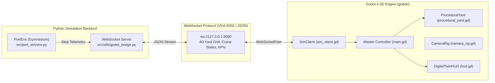

# Smart Port & Warehouse 3D Digital Twin (Godot 4)

- **Motivation/Background**: High-performance 3D visualization and physical simulation are critical for validating Multi-Agent Reinforcement Learning (MARL) container placement, crane dispatching, and AGV fleet routing.
- **Purpose**: Serve as the user manual, architecture guide, scene catalog, and keybinding reference for the Godot 4 3D Digital Twin application.
- **Overview Pipeline**: Renders a procedural 3D port and yard environment synchronized with [`src/port_sim/`](../src/port_sim) via the WebSocket telemetry bridge ([`src/utils/godot_bridge.py`](../src/utils/godot_bridge.py)).
- **Detailed Plan**: §1 Architecture; §2 Features & Entities; §3 Controls & Keybindings; §4 Project Layout; §5 Execution Modes.
- **References**: [`docs/PURPOSE.md`](../docs/PURPOSE.md), [`docs/phases/03_GODOT_3D_DIGITAL_TWIN.md`](../docs/phases/03_GODOT_3D_DIGITAL_TWIN.md), [`docs/walkthrough.md`](../docs/walkthrough.md).
- **Created**: 2026-09-14T22:47:00+07:00
- **Last Updated**: 2026-09-14T22:47:00+07:00

---

## 1. 🏗️ Architecture Overview

The Godot 3D Digital Twin interfaces asynchronously with the Python RL pipeline via WebSockets over `ws://127.0.0.1:9090`:



---

## 2. 🌟 Features & Physical Entities

1. **Procedural Yard Generation ([`scripts/environment/procedural_yard.gd`](scripts/environment/procedural_yard.gd))**:
   - Dynamically constructs yard blocks, bays, stacks, and tiers matching [`src/port_sim/config.py`](../src/port_sim/config.py).
   - Generates concrete foundation pads and maintains spatial coordinate slots for real-time placement synchronization.
2. **PBR Water Surface ([`scripts/environment/water_shader.gdshader`](scripts/environment/water_shader.gdshader))**:
   - Vertex wave displacement, depth-based color gradients, and specular glints.
3. **PBR ISO Shipping Containers ([`scenes/entities/container.tscn`](scenes/entities/container.tscn))**:
   - Standard 20ft container proportions ($6.06\text{ m} \times 2.44\text{ m} \times 2.59\text{ m}$).
   - Dynamic PBR materials color-coded by container class:
     - **Import**: Marine Blue (`#0077b6`)
     - **Export**: Emerald Green (`#2a9d8f`)
     - **Transshipment**: Sunset Amber (`#f4a261`)
   - Highlight emission pulsing and smooth tweened kinematics for lifting and placing.
4. **Ship-to-Shore (STS) Quay Crane ([`scenes/entities/quay_crane.tscn`](scenes/entities/quay_crane.tscn))**:
   - 3-axis motion: gantry travel along berth rail tracks ($X$), trolley traverse along boom ($Z$), and spreader hoist ($Y$).
5. **Autonomous Guided Vehicle (AGV) ([`scenes/entities/agv.tscn`](scenes/entities/agv.tscn))**:
   - Ground lane transport platform with deck container locking.
6. **Container Vessel ([`scenes/entities/ship.tscn`](scenes/entities/ship.tscn))**:
   - Cargo ship with hull, cargo holds, and superstructure moored at berth.
7. **Industrial HUD Dashboard ([`scenes/ui/hud.tscn`](scenes/ui/hud.tscn))**:
   - Displays real-time KPI cards: **Step Count**, **Simulation Time**, **Accumulated Reward**.
   - Connection status badge (`ONLINE` / `OFFLINE`).
   - Live scrolling event log.
   - Interactive playback controls: **Step**, **Auto-Run**, **Reset**.

---

## 3. 🎮 Camera Controls & Keybindings

The 3D environment features an RTS-style simulation camera rig ([`scripts/ui/camera_rig.gd`](scripts/ui/camera_rig.gd)):

| Input | Action |
| :--- | :--- |
| `W` / `A` / `S` / `D` (or Arrow Keys) | Smooth horizontal camera pan across the terminal |
| `Right Mouse Button` (Hold & Drag) | 360° Orbit (yaw rotation) and elevation tilt (pitch) |
| `Middle Mouse Button` (Hold & Drag) | Alternate orbit control |
| `Mouse Wheel Up` / `Down` | Smooth zoom in / zoom out (with distance clamping) |
| `1` | **Preset 1:** Isometric 3D Overview (default angle) |
| `2` | **Preset 2:** Top-down 2D Orthographic Yard Plan |
| `3` | **Preset 3:** Quay & Mooring Close-up View |

---

## 4. 📁 Project Layout

```text
godot/
├── project.godot                          # Godot 4.3 project configuration
├── icon.svg                               # Digital twin application icon
├── README.md                              # This manual
├── scenes/
│   ├── main.tscn                          # Master integrated scene
│   ├── environment/
│   │   ├── water.tscn                     # PBR water surface plane
│   │   ├── berth.tscn                     # Concrete quay & rail tracks
│   │   └── yard_grid.tscn                 # Procedural yard container grid
│   ├── entities/
│   │   ├── container.tscn                 # ISO container with PBR material
│   │   ├── quay_crane.tscn                # STS Gantry crane
│   │   ├── agv.tscn                       # Autonomous mobile platform
│   │   └── ship.tscn                      # Moored container vessel
│   └── ui/
│       ├── camera_controller.tscn         # RTS camera rig
│       └── hud.tscn                       # Real-time KPI dashboard overlay
└── scripts/
    ├── main.gd                            # Master controller & state dispatcher
    ├── bridge/
    │   └── sim_client.gd                  # WebSocket client bridge
    ├── environment/
    │   ├── procedural_yard.gd             # Procedural slot generation & sync
    │   └── water_shader.gdshader          # Vertex wave shader
    ├── entities/
    │   ├── container.gd                   # Dynamic coloring & tween animations
    │   ├── quay_crane.gd                  # 3-axis crane kinematics
    │   ├── agv_agent.gd                   # Vehicle navigation & deck locking
    │   └── ship.gd                        # Vessel cargo status
    └── ui/
        ├── camera_rig.gd                  # Orbit / pan / zoom / presets
        └── hud.gd                         # Telemetry display & button events
```

---

## 5. 🚀 Execution Modes

### Mode A: Connected Live Simulation (Recommended)
1. Launch the Python telemetry server from the repository root:
   ```bash
   python src/utils/godot_bridge.py --scenario default
   ```
2. Open [`godot/project.godot`](project.godot) in Godot 4 and press **F5** (or run `godot --path godot/`).
3. The HUD badge will turn **`● ONLINE (WebSocket)`**.
4. Click **"Step"** or **"Auto Run"** in the HUD: the Python environment will advance and the Godot 3D yard will update its container stacks in real time.

### Mode B: Standalone / Offline Presentation Mode
- Run Godot directly without starting Python.
- The Digital Twin launches with a populated demonstration yard and local fallback stepping, enabling full inspection of camera angles, materials, and animations without backend dependencies.
