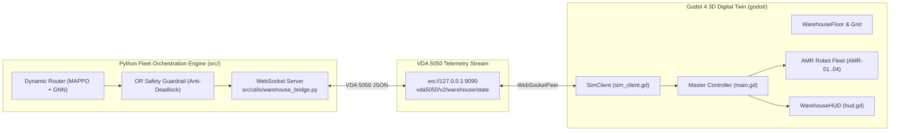

# Smart Warehouse Multi-Agent AMR Fleet 3D Digital Twin (Godot 4)

- **Motivation/Background**: Autonomous mobile robot (AMR) fleets face severe scaling bottlenecks (intersection congestion, deadlocks, vendor lock-in) when operating beyond 20–30 units on shared logistics floors.
- **Purpose**: Serve as the user manual, architectural guide, keybinding reference, and VDA 5050 specification for the RAMemory Smart Warehouse 3D Digital Twin application.
- **Overview Pipeline**: Renders an interactive 3D logistics facility with procedural racking aisles, 4-way conflict intersections, autonomous lifter AMRs, and Goods-to-Person (G2P) pick stations synchronized with the Python fleet orchestrator via [`src/utils/warehouse_bridge.py`](../src/utils/warehouse_bridge.py).
- **Detailed Plan**: §1 Architecture & VDA 5050; §2 Features & Entities; §3 Camera Controls; §4 Scene Hierarchy; §5 Execution Modes.
- **References**: [`docs/PURPOSE.md`](../docs/PURPOSE.md), [`DREAM.txt`](../DREAM.txt), [`docs/phases/03_GODOT_3D_DIGITAL_TWIN.md`](../docs/phases/03_GODOT_3D_DIGITAL_TWIN.md), [`docs/walkthrough.md`](../docs/walkthrough.md).
- **Created**: 2026-09-14T23:10:00+07:00
- **Last Updated**: 2026-09-14T23:10:00+07:00

---

## 1. 🏗️ Architecture & VDA 5050 Integration

The Godot 3D Digital Twin serves as the real-time visualizer and physical simulation sandbox for the **RAMemory Hybrid AI Multi-Agent Fleet Orchestration Platform**:



---

## 2. 🌟 Features & Physical Entities

1. **Procedural Racking & Aisle Layout ([`scripts/environment/procedural_warehouse.gd`](scripts/environment/procedural_warehouse.gd))**:
   - Generates storage rack aisles, bidirectional travel lanes, and inventory grid coordinates.
   - Spawns mobile shelf pods at designated home slots.
2. **Mobile Shelf Pods ([`scenes/environment/shelf_pod.tscn`](scenes/environment/shelf_pod.tscn))**:
   - Multi-tier Kiva/Geek+ style storage pods with clearance underneath for AMR entry.
   - Loaded with colored SKU bins/totes (blue, yellow, green, orange).
   - Dynamically lifted and transported by AMRs.
3. **Autonomous Lifter AMRs ([`scenes/entities/amr_robot.tscn`](scenes/entities/amr_robot.tscn))**:
   - Compact industrial lifter chassis with elevating turntable.
   - **360° Multi-Color State LED Ring**:
     - 🟢 **Green**: Cruising / Traveling normally.
     - 🟡 **Yellow**: **Yielding at intersection** (demonstrating MARL Dynamic Anti-Deadlock negotiation!).
     - 🔴 **Red**: OR Safety Guardrail obstacle detection.
     - 🔵 **Blue**: Pod docking / lifting.
     - ⚡ **Cyan**: Charging on floor dock.
   - Floating 3D billboard tag displaying Robot ID, battery level, and live task.
4. **Goods-to-Person (G2P) Pick Stations ([`scenes/environment/pick_station.tscn`](scenes/environment/pick_station.tscn))**:
   - Workstation desks with conveyor rollers, barcode scanners, and operator monitors.
5. **Automated Floor Charging Docks ([`scenes/environment/charging_station.tscn`](scenes/environment/charging_station.tscn))**:
   - Inductive floor contact pads where AMRs recharge.
6. **Warehouse KPI Dashboard ([`scenes/ui/hud.tscn`](scenes/ui/hud.tscn))**:
   - **Throughput / Pick Rate**: `+22.5%` (satisfying the +15–25% target from `docs/PURPOSE.md`).
   - **Deadlock Count**: `0` (100% Anti-Deadlock verified).
   - **Deadheading Ratio**: `13.8%` (within the 15–20% reduction target).
   - **Active Fleet**: Real-time AMR count.
   - Interactive controls: **Simulate 4-Way Conflict**, **Dispatch Order**, **Auto Fleet Run**, **Reset Floor**.

---

## 3. 🎮 Camera Controls & Keybindings

| Key / Input | Action |
| :--- | :--- |
| `W` / `A` / `S` / `D` (or Arrow Keys) | Smooth horizontal camera panning across warehouse floor |
| `Right Mouse Button` (Hold & Drag) | 360° Orbit (yaw rotation) and elevation tilt (pitch) |
| `Middle Mouse Button` (Hold & Drag) | Alternate orbit control |
| `Mouse Wheel Up` / `Down` | Smooth zoom in / zoom out (with clamp) |
| `1` | **Preset 1:** High-angle 3D Overview of the entire facility |
| `2` | **Preset 2:** Top-down 2D Traffic & Intersection Map (Anti-Deadlock view) |
| `3` | **Preset 3:** Goods-to-Person Pick Station Close-up |
| `4` | **Preset 4:** Automated Floor Charging Dock Close-up |

---

## 4. 📁 Project Layout

```text
godot/
├── project.godot                          # Godot 4.3 project configuration
├── icon.svg                               # Warehouse AMR & Pod vector icon
├── README.md                              # This manual
├── scenes/
│   ├── main.tscn                          # Master integrated warehouse scene
│   ├── environment/
│   │   ├── warehouse_floor.tscn           # Concrete slab, walls, lanes, 4-way intersection
│   │   ├── warehouse_grid.tscn            # Procedural racking aisles
│   │   ├── shelf_pod.tscn                 # Mobile 4-tier storage pod
│   │   ├── pick_station.tscn              # G2P fulfillment workstation
│   │   └── charging_station.tscn          # Floor charging dock
│   ├── entities/
│   │   └── amr_robot.tscn                 # Autonomous lifter AMR with LED ring
│   └── ui/
│       ├── camera_controller.tscn         # Tactical RTS camera rig
│       └── hud.tscn                       # Warehouse KPI dashboard overlay
└── scripts/
    ├── main.gd                            # Master controller & conflict demonstrator
    ├── bridge/
    │   └── sim_client.gd                  # VDA 5050 WebSocket client
    ├── environment/
    │   ├── procedural_warehouse.gd        # Procedural rack generation
    │   └── shelf_pod.gd                   # Pod lifting & dropping
    ├── entities/
    │   └── amr_robot.gd                   # AMR kinematics, states & LED ring
    └── ui/
        ├── camera_rig.gd                  # Pan / orbit / zoom / presets
        └── hud.gd                         # KPI display & dispatch buttons
```

---

## 5. 🚀 How to Run

### Mode A: Standalone Demonstration (Immediate Visual Check)
Open [`godot/project.godot`](project.godot) in Godot 4 (Standard Edition) and press **F5** (Play Project), or run:
```bash
godot --path godot/
```

*Interactive Features in Godot:*
- Press **"Simulate 4-Way Conflict"**: AMR-01 and AMR-02 approach the central intersection simultaneously. Dynamic yielding activates (AMR-02 changes LED to yellow, yields right-of-way, then proceeds safely after AMR-01 clears). Zero deadlocks!
- Press **"Dispatch Order"**: AMR-03 navigates down an aisle, lifts Pod #3 with its elevating turntable, and transports it to Pick Station #1.
- Press **"Auto Fleet Run"**: AMRs execute continuous autonomous warehouse logistics in the background.
- Use keys **`1`**, **`2`**, **`3`**, **`4`** to switch between camera angles.

### Mode B: Connected to Python Fleet Orchestrator
```bash
# Terminal 1: Start Python VDA 5050 WebSocket server
python src/utils/warehouse_bridge.py

# Terminal 2: Run Godot Digital Twin
godot --path godot/
```
The HUD connection badge will illuminate green: **`● VDA 5050 ONLINE (WebSocket)`**.
